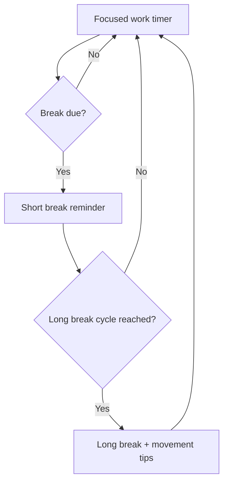

# SafeEyes for macOS

Safe Eyes is a cross-platform eye-strain reminder that runs in the background, scheduling customizable microbreaks and longer rests. This fork focuses on a macOS-native experience with bilingual prompts, persistent settings, and starter scripts that feel at home on the Mac desktop.

## Overview
- Works entirely with built-in macOS tooling (`osascript`)—no extra packages required.
- Provides English and Chinese notifications, dialogs, and terminal prompts.
- Persists preferences in `~/.eyecare_settings.json` so your cadence survives restarts.
- Ships multiple launch options: native dialogs, fullscreen overlay, and a lightweight menu flow.

## Break Flow at a Glance


## Quick Start
1. Ensure macOS has Python 3.9+ available (`python3 --version`).
2. Clone the repository and enter it:
   ```bash
   git clone git@github.com:EdwinJia1/SafeEyes-mac-.git
   cd SafeEyes-mac-
   ```
3. (Optional) Create a virtual environment if you plan to hack on the scripts:
   ```bash
   python3 -m venv .venv
   source .venv/bin/activate
   ```
4. Launch the fullscreen experience (recommended):
   ```bash
   python3 mac_eyecare_fullscreen.py --start
   # press Ctrl+C in the terminal to stop
   ```

## Usage Instructions

### Command Line Options
```bash
# Start eye care reminder directly
python3 mac_eyecare_fullscreen.py --start

# Use preset modes
python3 mac_eyecare_fullscreen.py --relax       # Relax Mode
python3 mac_eyecare_fullscreen.py --focus       # Focus Mode
python3 mac_eyecare_fullscreen.py --intensive   # Intensive Mode

# Configure settings
python3 mac_eyecare_fullscreen.py --config

# Test fullscreen reminder
python3 mac_eyecare_fullscreen.py --test

# Show help information
python3 mac_eyecare_fullscreen.py --help

# Interactive mode
python3 mac_eyecare_fullscreen.py
```

### Settings Configuration

#### Accessing Settings Menu
- **Press the ESC key at any time during program execution** to access the quick configuration menu

#### Quick Configuration Options
When you press ESC, you'll see these options:

1. **😌 Relax Mode**: 30min work, 30sec break
2. **💪 Focus Mode**: 45min work, 1min break
3. **🏃‍♂️ Intensive Mode**: 25min work, 20sec break
4. **🎛️ Custom Configuration**: Detailed settings adjustment
5. **❌ Exit configuration**: Cancel and return to program

#### Program Controls
- **ESC key**: Access configuration menu anytime
- **Ctrl+C**: Stop the program

## Included Entry Points
- `mac_eyecare_fullscreen.py`: **RECOMMENDED** - immersive fullscreen overlay with ESC configuration
- `mac_eyecare_native.py`: bilingual notifications and dialogs backed by macOS
- `mac_eyecare_simple.py`: minimal reminders without dialogs
- `start_fullscreen_eyecare.sh`: shell wrapper for the fullscreen mode
- `start_eyecare.sh`: shell wrapper for the native notifier

## Preset Modes Details

### 😌 Relax Mode
- **Work time**: 30 minutes
- **Short break**: 30 seconds
- **Long break**: 10 minutes
- **Cycles**: Every 2 cycles
- **Best for**: Light work, frequent breaks

### 💪 Focus Mode
- **Work time**: 45 minutes
- **Short break**: 1 minute
- **Long break**: 15 minutes
- **Cycles**: Every 3 cycles
- **Best for**: Deep work, longer focus periods

### 🏃‍♂️ Intensive Mode
- **Work time**: 25 minutes
- **Short break**: 20 seconds
- **Long break**: 5 minutes
- **Cycles**: Every 4 cycles
- **Best for**: High-intensity work, short focus bursts

## Configuration File
Settings are stored in `~/.eyecare_settings.json`; you can also edit this file directly:

```json
{
  "work_time": 25,
  "break_time": 20,
  "long_break_time": 5,
  "cycles_before_long_break": 4,
  "language": "zh",
  "notifications_enabled": true,
  "sound_enabled": true
}
```

## Recent Fixes / Changelog

### 🔧 Major Fixes
- ✅ **Fixed ESC key configuration menu not displaying options** - ESC key now properly shows all available configuration choices with clear visual feedback
- ✅ **Fixed terminal input issues after ESC key press** - Terminal state is now properly restored, ensuring smooth user interaction
- ✅ **Improved terminal state management** - Enhanced terminal mode switching for better user experience across different environments
- ✅ **Fixed infinite loop in configuration menu** - Added input validation and attempt limits to prevent hanging
- ✅ **Added preset mode command-line options** - Direct access to Relax, Focus, and Intensive modes via `--relax`, `--focus`, `--intensive`

### 🚀 New Features
- 🎯 **ESC key quick configuration** - Press ESC anytime to access configuration menu
- 📋 **Preset modes** - Three carefully designed work/break patterns
- 🌐 **Enhanced bilingual support** - Improved English/Chinese interface
- ⚡ **Non-interactive environment support** - Graceful handling when running in scripts

## Tips & Troubleshooting
- Enable notifications for Terminal (System Settings → Notifications) if alerts do not appear.
- Test that AppleScript dialogs are allowed: `osascript -e 'display notification "test"'`.
- Stuck settings? Remove `~/.eyecare_settings.json` and rerun `--config` to regenerate defaults.
- Want autostart? Create a `launchd` agent that calls `start_eyecare.sh --start` when you log in.

## Credits
Built on top of the original [Safe Eyes](https://github.com/slgobinath/SafeEyes) project. This macOS-focused fork keeps the same spirit—gentle nudges to care for your eyes—while embracing Apple-native UX.
