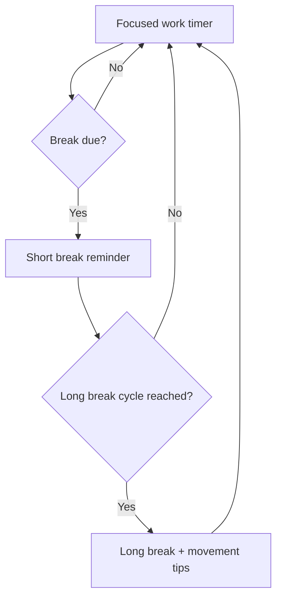

# SafeEyes for macOS

Safe Eyes is a cross-platform eye-strain reminder that runs in the background, scheduling customizable microbreaks and longer rests. This fork focuses on a macOS-native experience with bilingual prompts, persistent settings, and starter scripts that feel at home on the Mac desktop.

## Overview
- Works entirely with built-in macOS tooling (`osascript`)—no extra packages required.
- Provides English and Chinese notifications, dialogs, and terminal prompts.
- Persists preferences in `~/.eyecare_settings.json` so your cadence survives restarts.
- Ships multiple launch options: native dialogs, fullscreen overlay, and a lightweight menu flow.

## Break Flow at a Glance


## Quick Start
1. Ensure macOS has Python 3.9+ available (`python3 --version`).
2. Clone the repository and enter it:
   ```bash
   git clone git@github.com:EdwinJia1/SafeEyes-mac-.git
   cd SafeEyes-mac-
   ```
3. (Optional) Create a virtual environment if you plan to hack on the scripts:
   ```bash
   python3 -m venv .venv
   source .venv/bin/activate
   ```
4. Launch the native experience:
   ```bash
   python3 mac_eyecare_native.py --start
   # press Ctrl+C in the terminal to stop
   ```
5. Or run the helper shell wrapper (also supports `--start` / `--config`):
   ```bash
   ./start_eyecare.sh --start
   ```

## Included Entry Points
- `mac_eyecare_native.py`: bilingual notifications and dialogs backed by macOS.
- `mac_eyecare_fullscreen.py`: immersive fullscreen overlay during breaks.
- `mac_eyecare_simple.py`: minimal reminders without dialogs.
- `start_fullscreen_eyecare.sh`: shell wrapper for the fullscreen mode.
- `start_eyecare.sh`: shell wrapper for the native notifier.

## Configuration
Run `python3 mac_eyecare_native.py --config` (or the shell wrapper) to update timers, language, break cadence, and notification sounds. Settings are stored in `~/.eyecare_settings.json`; you can also edit this file directly:
```json
{
  "work_time": 20,
  "break_time": 20,
  "long_break_time": 5,
  "cycles_before_long_break": 3,
  "language": "en",
  "notifications_enabled": true,
  "sound_enabled": true
}
```

## Tips & Troubleshooting
- Enable notifications for Terminal (System Settings → Notifications) if alerts do not appear.
- Test that AppleScript dialogs are allowed: `osascript -e 'display notification "test"'`.
- Stuck settings? Remove `~/.eyecare_settings.json` and rerun `--config` to regenerate defaults.
- Want autostart? Create a `launchd` agent that calls `start_eyecare.sh --start` when you log in.

## Credits
Built on top of the original [Safe Eyes](https://github.com/slgobinath/SafeEyes) project. This macOS-focused fork keeps the same spirit—gentle nudges to care for your eyes—while embracing Apple-native UX.
