# SafeEyes for macOS / macOS 护眼提醒

Safe Eyes is a cross-platform eye-strain reminder that runs in the background, scheduling customizable microbreaks and longer rests. This fork focuses on a macOS-native experience with bilingual prompts, persistent settings, and starter scripts that feel at home on the Mac desktop.

Safe Eyes 是一个跨平台的护眼提醒程序，在后台运行，安排可定制的短暂休息和较长时间的休息。这个分支专注于 macOS 原生体验，提供双语提示、持久化设置和在 Mac 桌面上感觉自然的启动脚本。

## Overview / 概述
- Works entirely with built-in macOS tooling (`osascript`)—no extra packages required. / 完全使用内置的 macOS 工具（`osascript`）——无需额外软件包。
- Provides English and Chinese notifications, dialogs, and terminal prompts. / 提供英文和中文通知、对话框和终端提示。
- Persists preferences in `~/.eyecare_settings.json` so your cadence survives restarts. / 设置保存在 `~/.eyecare_settings.json` 中，重启后保持设置。
- Ships multiple launch options: native dialogs, fullscreen overlay, and a lightweight menu flow. / 提供多种启动选项：原生对话框、全屏覆盖和轻量级菜单流程。

## Break Flow at a Glance / 休息流程概览

```mermaid
graph TD
    A[专注工作计时器] --> B{需要休息吗?}
    B -- 否 --> A
    B -- 是 --> C[短暂休息提醒]
    C --> D{长休息周期到达?}
    D -- 否 --> A
    D -- 是 --> E[长休息 + 运动建议]
    E --> A
```


## Quick Start / 快速开始
1. Ensure macOS has Python 3.9+ available (`python3 --version`). / 确保 macOS 有 Python 3.9+ 版本（`python3 --version`）。
2. Clone the repository and enter it: / 克隆仓库并进入：
   ```bash
   git clone git@github.com:EdwinJia1/SafeEyes-mac-.git
   cd SafeEyes-mac-
   ```
3. (Optional) Create a virtual environment if you plan to hack on the scripts: /（可选）如果您计划修改脚本，请创建虚拟环境：
   ```bash
   python3 -m venv .venv
   source .venv/bin/activate
   ```
4. Launch the fullscreen experience (recommended): / 启动全屏体验（推荐）：
   ```bash
   python3 mac_eyecare_fullscreen.py --start
   # press Ctrl+C in the terminal to stop / 按终端中的 Ctrl+C 停止
   ```

## Usage Instructions / 使用说明

### Command Line Options / 命令行选项
```bash
# Start eye care reminder directly / 直接启动护眼提醒
python3 mac_eyecare_fullscreen.py --start

# Use preset modes / 使用预设模式
python3 mac_eyecare_fullscreen.py --relax       # Relax Mode / 放松模式
python3 mac_eyecare_fullscreen.py --focus       # Focus Mode / 专注模式
python3 mac_eyecare_fullscreen.py --intensive   # Intensive Mode / 密集模式

# Configure settings / 配置设置
python3 mac_eyecare_fullscreen.py --config

# Test fullscreen reminder / 测试全屏提醒
python3 mac_eyecare_fullscreen.py --test

# Show help information / 显示帮助信息
python3 mac_eyecare_fullscreen.py --help

# Interactive mode / 交互模式
python3 mac_eyecare_fullscreen.py
```

### Settings Configuration / 设置配置

#### Accessing Settings Menu / 访问设置菜单
- **Press the ESC key at any time during program execution** to access the quick configuration menu
- **在程序运行期间的任何时候按 ESC 键** 来访问快速配置菜单

#### Quick Configuration Options / 快速配置选项
When you press ESC, you'll see these options: / 当您按 ESC 时，会看到这些选项：

1. **😌 Relax Mode / 放松模式**: 30min work, 30sec break / 30分钟工作，30秒休息
2. **💪 Focus Mode / 专注模式**: 45min work, 1min break / 45分钟工作，1分钟休息
3. **🏃‍♂️ Intensive Mode / 密集模式**: 25min work, 20sec break / 25分钟工作，20秒休息
4. **🎛️ Custom Configuration / 自定义配置**: Detailed settings adjustment / 详细设置调整
5. **❌ Exit configuration / 退出配置**: Cancel and return to program / 取消并返回程序

#### Program Controls / 程序控制
- **ESC key**: Access configuration menu anytime / 随时访问配置菜单
- **Ctrl+C**: Stop the program / 停止程序

## Included Entry Points / 包含的入口点
- `mac_eyecare_fullscreen.py`: **RECOMMENDED** - immersive fullscreen overlay with ESC configuration / **推荐** - 具有ESC配置的沉浸式全屏覆盖
- `mac_eyecare_native.py`: bilingual notifications and dialogs backed by macOS / 双语通知和macOS对话框
- `mac_eyecare_simple.py`: minimal reminders without dialogs / 无对话框的最小提醒
- `start_fullscreen_eyecare.sh`: shell wrapper for the fullscreen mode / 全屏模式的shell包装器
- `start_eyecare.sh`: shell wrapper for the native notifier / 原生通知器的shell包装器

## Preset Modes Details / 预设模式详情

### 😌 Relax Mode / 放松模式
- **Work time / 工作时间**: 30 minutes / 30分钟
- **Short break / 短休息**: 30 seconds / 30秒
- **Long break / 长休息**: 10 minutes / 10分钟
- **Cycles / 循环次数**: Every 2 cycles / 每2个循环
- **Best for / 最适合**: Light work, frequent breaks / 轻松工作，频繁休息

### 💪 Focus Mode / 专注模式
- **Work time / 工作时间**: 45 minutes / 45分钟
- **Short break / 短休息**: 1 minute / 1分钟
- **Long break / 长休息**: 15 minutes / 15分钟
- **Cycles / 循环次数**: Every 3 cycles / 每3个循环
- **Best for / 最适合**: Deep work, longer focus periods / 深度工作，较长专注时间

### 🏃‍♂️ Intensive Mode / 密集模式
- **Work time / 工作时间**: 25 minutes / 25分钟
- **Short break / 短休息**: 20 seconds / 20秒
- **Long break / 长休息**: 5 minutes / 5分钟
- **Cycles / 循环次数**: Every 4 cycles / 每4个循环
- **Best for / 最适合**: High-intensity work, short focus bursts / 高强度工作，短时专注

## Configuration File / 配置文件
Settings are stored in `~/.eyecare_settings.json`; you can also edit this file directly: / 设置保存在 `~/.eyecare_settings.json` 中；您也可以直接编辑此文件：

```json
{
  "work_time": 25,
  "break_time": 20,
  "long_break_time": 5,
  "cycles_before_long_break": 4,
  "language": "zh",
  "notifications_enabled": true,
  "sound_enabled": true
}
```

## Recent Fixes / Changelog / 最近修复 / 更新日志

### 🔧 Major Fixes / 主要修复
- ✅ **Fixed ESC key configuration menu not displaying options** - ESC key now properly shows all available configuration choices with clear visual feedback / **修复了ESC键配置菜单不显示选项的问题** - ESC键现在正确显示所有可用配置选择和清晰的视觉反馈
- ✅ **Fixed terminal input issues after ESC key press** - Terminal state is now properly restored, ensuring smooth user interaction / **修复了ESC键按后终端输入问题** - 终端状态现在正确恢复，确保流畅的用户交互
- ✅ **Improved terminal state management** - Enhanced terminal mode switching for better user experience across different environments / **改进了终端状态管理** - 增强了终端模式切换，在不同环境中提供更好的用户体验
- ✅ **Fixed infinite loop in configuration menu** - Added input validation and attempt limits to prevent hanging / **修复了配置菜单中的无限循环** - 添加了输入验证和尝试限制以防止挂起
- ✅ **Added preset mode command-line options** - Direct access to Relax, Focus, and Intensive modes via `--relax`, `--focus`, `--intensive` / **添加了预设模式命令行选项** - 通过 `--relax`、`--focus`、`--intensive` 直接访问放松、专注和密集模式

### 🚀 New Features / 新功能
- 🎯 **ESC key quick configuration** - Press ESC anytime to access configuration menu / **ESC键快速配置** - 随时按ESC访问配置菜单
- 📋 **Preset modes** - Three carefully designed work/break patterns / **预设模式** - 三种精心设计的工作/休息模式
- 🌐 **Enhanced bilingual support** - Improved English/Chinese interface / **增强的双语支持** - 改进的英文/中文界面
- ⚡ **Non-interactive environment support** - Graceful handling when running in scripts / **非交互环境支持** - 在脚本中运行时的优雅处理

## Tips & Troubleshooting / 提示和故障排除
- Enable notifications for Terminal (System Settings → Notifications) if alerts do not appear. / 如果警报不出现，请为终端启用通知（系统设置 → 通知）。
- Test that AppleScript dialogs are allowed: `osascript -e 'display notification "test"'`. / 测试AppleScript对话框是否被允许：`osascript -e 'display notification "test"'`。
- Stuck settings? Remove `~/.eyecare_settings.json` and rerun `--config` to regenerate defaults. / 设置卡住了？删除 `~/.eyecare_settings.json` 并重新运行 `--config` 来重新生成默认值。
- Want autostart? Create a `launchd` agent that calls `start_eyecare.sh --start` when you log in. / 想要自动启动？创建一个 `launchd` 代理，在您登录时调用 `start_eyecare.sh --start`。

## Credits / 致谢
Built on top of the original [Safe Eyes](https://github.com/slgobinath/SafeEyes) project. This macOS-focused fork keeps the same spirit—gentle nudges to care for your eyes—while embracing Apple-native UX.

基于原始 [Safe Eyes](https://github.com/slgobinath/SafeEyes) 项目构建。这个专注于 macOS 的分支保持相同的精神——温柔地提醒您关爱眼睛——同时拥抱 Apple 原生用户体验。
