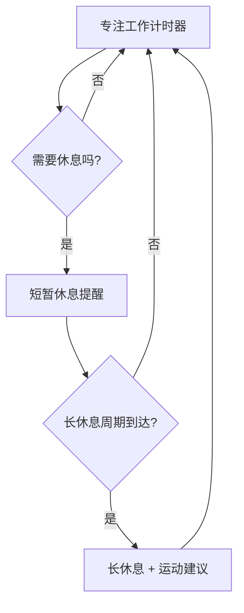

# SafeEyes for macOS - macOS 护眼提醒

Safe Eyes 是一个跨平台的护眼提醒程序，在后台运行，安排可定制的短暂休息和较长时间的休息。这个分支专注于 macOS 原生体验，提供双语提示、持久化设置和在 Mac 桌面上感觉自然的启动脚本。

## 概述
- 完全使用内置的 macOS 工具（`osascript`）——无需额外软件包。
- 提供英文和中文通知、对话框和终端提示。
- 设置保存在 `~/.eyecare_settings.json` 中，重启后保持设置。
- 提供多种启动选项：原生对话框、全屏覆盖和轻量级菜单流程。

## 休息流程概览


## 快速开始
1. 确保 macOS 有 Python 3.9+ 版本（`python3 --version`）。
2. 克隆仓库并进入：
   ```bash
   git clone git@github.com:EdwinJia1/SafeEyes-mac-.git
   cd SafeEyes-mac-
   ```
3. （可选）如果您计划修改脚本，请创建虚拟环境：
   ```bash
   python3 -m venv .venv
   source .venv/bin/activate
   ```
4. 启动全屏体验（推荐）：
   ```bash
   python3 mac_eyecare_fullscreen.py --start
   # 按终端中的 Ctrl+C 停止
   ```

## 使用说明

### 命令行选项
```bash
# 直接启动护眼提醒
python3 mac_eyecare_fullscreen.py --start

# 使用预设模式
python3 mac_eyecare_fullscreen.py --relax       # 放松模式
python3 mac_eyecare_fullscreen.py --focus       # 专注模式
python3 mac_eyecare_fullscreen.py --intensive   # 密集模式

# 配置设置
python3 mac_eyecare_fullscreen.py --config

# 测试全屏提醒
python3 mac_eyecare_fullscreen.py --test

# 显示帮助信息
python3 mac_eyecare_fullscreen.py --help

# 交互模式
python3 mac_eyecare_fullscreen.py
```

### 设置配置

#### 访问设置菜单
- **在程序运行期间的任何时候按 ESC 键** 来访问快速配置菜单

#### 快速配置选项
当您按 ESC 时，会看到这些选项：

1. **😌 放松模式**: 30分钟工作，30秒休息
2. **💪 专注模式**: 45分钟工作，1分钟休息
3. **🏃‍♂️ 密集模式**: 25分钟工作，20秒休息
4. **🎛️ 自定义配置**: 详细设置调整
5. **❌ 退出配置**: 取消并返回程序

#### 程序控制
- **ESC键**: 随时访问配置菜单
- **Ctrl+C**: 停止程序

## 包含的入口点
- `mac_eyecare_fullscreen.py`: **推荐** - 具有ESC配置的沉浸式全屏覆盖
- `mac_eyecare_native.py`: 双语通知和macOS对话框
- `mac_eyecare_simple.py`: 无对话框的最小提醒
- `start_fullscreen_eyecare.sh`: 全屏模式的shell包装器
- `start_eyecare.sh`: 原生通知器的shell包装器

## 预设模式详情

### 😌 放松模式
- **工作时间**: 30分钟
- **短休息**: 30秒
- **长休息**: 10分钟
- **循环次数**: 每2个循环
- **最适合**: 轻松工作，频繁休息

### 💪 专注模式
- **工作时间**: 45分钟
- **短休息**: 1分钟
- **长休息**: 15分钟
- **循环次数**: 每3个循环
- **最适合**: 深度工作，较长专注时间

### 🏃‍♂️ 密集模式
- **工作时间**: 25分钟
- **短休息**: 20秒
- **长休息**: 5分钟
- **循环次数**: 每4个循环
- **最适合**: 高强度工作，短时专注

## 配置文件
设置保存在 `~/.eyecare_settings.json` 中；您也可以直接编辑此文件：

```json
{
  "work_time": 25,
  "break_time": 20,
  "long_break_time": 5,
  "cycles_before_long_break": 4,
  "language": "zh",
  "notifications_enabled": true,
  "sound_enabled": true
}
```

## 最近修复 / 更新日志

### 🔧 主要修复
- ✅ **修复了ESC键配置菜单不显示选项的问题** - ESC键现在正确显示所有可用配置选择和清晰的视觉反馈
- ✅ **修复了ESC键按后终端输入问题** - 终端状态现在正确恢复，确保流畅的用户交互
- ✅ **改进了终端状态管理** - 增强了终端模式切换，在不同环境中提供更好的用户体验
- ✅ **修复了配置菜单中的无限循环** - 添加了输入验证和尝试限制以防止挂起
- ✅ **添加了预设模式命令行选项** - 通过 `--relax`、`--focus`、`--intensive` 直接访问放松、专注和密集模式

### 🚀 新功能
- 🎯 **ESC键快速配置** - 随时按ESC访问配置菜单
- 📋 **预设模式** - 三种精心设计的工作/休息模式
- 🌐 **增强的双语支持** - 改进的英文/中文界面
- ⚡ **非交互环境支持** - 在脚本中运行时的优雅处理

## 提示和故障排除
- 如果警报不出现，请为终端启用通知（系统设置 → 通知）。
- 测试AppleScript对话框是否被允许：`osascript -e 'display notification "test"'`。
- 设置卡住了？删除 `~/.eyecare_settings.json` 并重新运行 `--config` 来重新生成默认值。
- 想要自动启动？创建一个 `launchd` 代理，在您登录时调用 `start_eyecare.sh --start`。

## 致谢
基于原始 [Safe Eyes](https://github.com/slgobinath/SafeEyes) 项目构建。这个专注于 macOS 的分支保持相同的精神——温柔地提醒您关爱眼睛——同时拥抱 Apple 原生用户体验。